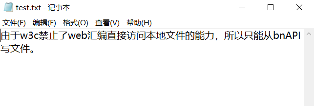
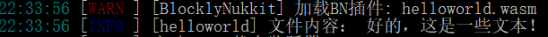

# java互操作初步
**——以文本文件读写为例**
[toc]
本章节中笔者将带您使用C/C++在沙盒环境内进行外部文件读写。
## 沙盒环境？
没错，前问提到了，我们将C/C++源代码编译为wasm文件，即webassembly沙盒字节码，又叫做web汇编，这是由**w3c**(万维网联盟)制定的一套跨平台应用分发解决方案，目前，C/C++，Rust，Go，Swift，Lua等众多语言都支持此标准，它有很多好处，比如跨平台运行 *甚至可以运行在浏览器/微信小程序这样的环境中*，比如运行速度飞快 *它是世界上运行最快的虚拟机，可以达到90%的原生速度*其最突出的一个特点是：绝对安全。此标准规定应用程序不得访问外部文件系统，不得访问分配额之外的内存，不得访问底层硬件等等。所以，我们不得不通过其他的方式来操作文件。
## 通过manager基对象写文件
### 专有java堆栈？
每一个C/C++插件被初始化的时候都会分配一个专有java堆栈，这个堆栈是与你的C/C++运行内存堆栈分离的，用于存储C/C++插件需要或运行时产生的所有的java对象。你不可以直接将他们复制到某个指针所指向的内存中，请牢记，遵循web汇编沙箱安全原则，两个堆栈是完全分开的。但是，你可以通过bn提供的API函数对他们进行操作，获取他们的信息，执行他们的成员函数。一个java对象在C/C++中以一个`int`类型的索引来表示
### 什么是基对象？
基对象，顾名思义，基本的对象。基对象是一系列含有API函数作为成员函数的对象，他们会在启动的时候被bn推入你的C/C++插件独有的java堆栈。基对象，是插件操作服务器的重要桥梁。C/C++插件的基对象和解释型语言的基对象是完全一样的，你可以在 **#bn编程开发->#运行时解释语言->#编程开发文档** 章节中查看。
### 1. 把需要的信息推入java堆栈
bnAPI提供了5个函数来把C/C++中的信息复制并推入java堆栈中：
```
int pushIntToJavaStack(int toPush);
int pushLongToJavaStack(long long int toPush);
int pushFloatToJavaStack(float toPush);
int pushDoubleToJavaStack(double toPush);
int pushStringToJavaStack(char* toPush);
#ifdef __cplusplus
int pushStringToJavaStack(std::string toPush);
#endif
```
下面，我们将要写入的文件路径和写入的字符串推入java堆栈中：
```
#include <blocklynukkit>
using namespace BlocklyNukkit;
int main(){
    auto path = pushStringToJavaStack("./plugins/myFiles/test.txt");
    auto content = pushStringToJavaStack("由于w3c禁止了web汇编直接访问本地文件的能力，所以只能从bnAPI写文件。");
    return 0;
}
```
上面的相对路径是以nukkit服务端核心而言的，bn在一会创建文件的时候会自动递归创建文件夹和文件。
### 2.获取manager基对象索引
接下来，我们从java堆栈上获取manager基对象对应的索引：
```
#include <blocklynukkit>
using namespace BlocklyNukkit;
int main(){
    auto path = pushStringToJavaStack("./plugins/myFiles/test.txt");
    auto content = pushStringToJavaStack("由于w3c禁止了web汇编直接访问本地文件的能力，所以只能从bnAPI写文件。");
    auto manager = getJIndexByKey("manager");
    return 0;
}
```
获取索引很简单，只需要调用`getJIndexByKey`函数
### 3.获取writeFile成员函数索引
没错，java中啥都是对象，包括一个成员函数也是一个对象，调用`getJMethod`函数来获取java对象的成员函数对象的索引，前两个参数都很好理解，第一个是要被获取的那个java对象的索引，第二个是要获取的成员函数的名称，第三个叫方法签名，所谓方法签名，就是每一个java中每一个成员函数的身份标识，因为java和C++一样支持重载，可能出现多个成员函数同名的情况，所以我们要根据方法签名来区分，获取准确的那一个成员函数。  
获取一个方法签名很简单，bn提供了signature命令，在服务器启动后，控制台输入`signature 基对象/java类名 成员函数名`即可获取指定函数的方法签名，如果输入`signature 基对象/java类名`将会输出所有的成员函数的方法签名。  
为了开发方便，你也可以手动编写，方法签名的规则很简单，就是把一个成员函数每一个参数的类的名称用`;`连起来，如果确认这个成员函数没有多个有相同数量参数的重名成员函数，那么方法签名可以直接用对应参数数量的`*;`来替代，比如一个函数有两个参数而且所有跟它重名的成员和函数的参数都不是两个，那么它的方法签名就可以写作`*;*;`。如果某个成员函数有多个相同数量参数的重名成员参数，你可以只写某一个可以将它们区分出来的参数的完整类名，而剩下的用`*`替代，就是说，以上两种方式可以混用，只要能准确区分出某一个特定的成员函数即可。
查询[bn编程开发文档](http://www.blocklynukkit.info/1994516)，找到位于`manager`基对象下的`writeFile`函数：
|方法名|参数|返回值|解释|
|-|-|-|-|
|writeFile|String path,String text|void|向path路径的文件(不存在自动创建)以utf8编码写入text|
  
现在，我们来获取`writeFIle`成员函数的对象索引：
> P.S. java程序员习惯把对象的成员函数称作“方法”

```
#include <blocklynukkit>
using namespace BlocklyNukkit;
int main(){
    auto path = pushStringToJavaStack("./plugins/myFiles/test.txt");
    auto content = pushStringToJavaStack("由于w3c禁止了web汇编直接访问本地文件的能力，所以只能从bnAPI写文件。");
    auto manager = getJIndexByKey("manager");
    auto writeMethod = getJMethod(manager,"writeFile","*;*;");
    return 0;
}
```
### 4.调用方法，写入文件
最后一步，就是把我们获取到的函数进行调用，来真正地把文件写入：
```
#include <blocklynukkit>
using namespace BlocklyNukkit;
int main(){
    auto path = pushStringToJavaStack("./plugins/myFiles/test.txt");
    auto content = pushStringToJavaStack("由于w3c禁止了web汇编直接访问本地文件的能力，所以只能从bnAPI写文件。");
    auto manager = getJIndexByKey("manager");
    auto writeMethod = getJMethod(manager,"writeFile","*;*;");
    int args[] = {path,content};
    invokeJMethod(writeMethod,manager,2,args);
    logger << "写入完成"  << endl;
    return 0;
}
```
这里，我们使用了`invokeJMethod`函数来调用对应的java函数，所有的参数都必须放在java堆栈上面，调用的时候我们要指定调用的成员函数，成员函数归属的对象，参数个数和参数数组。之所以要传入成员函数归属的对象，因为成员函数是无状态的，bn解释器并不能知道成员函数是从哪获取的，也就是说，如果有两个同类的java对象，只需获取一遍成员函数，这个获取到的成员函数能在两个对象下都被调用。传入的参数数组，如果没有参数，即第三个参数为0的情况，只需传入`NULL`即可。
### 5.为java堆栈清理不必要的临时变量
正如你所知的，C/C++的变量在函数都执行完之后会自动被全部释放掉，这里我们就不手动释放C++中的变量了，但是java堆栈上的变量不会被自动清除掉，可能其他插件会获取你的C++插件的java堆栈上的信息，所以这时你要手动删除：
```
#include <blocklynukkit>
using namespace BlocklyNukkit;
int main(){
    auto path = pushStringToJavaStack("./plugins/myFiles/test.txt");
    auto content = pushStringToJavaStack("由于w3c禁止了web汇编直接访问本地文件的能力，所以只能从bnAPI写文件。");
    auto manager = getJIndexByKey("manager");
    auto writeMethod = getJMethod(manager,"writeFile","*;*;");
    int args[] = {path,content};
    invokeJMethod(writeMethod,manager,2,args);
    logger << "写入完成"  << endl;
    deleteJObject(path);
    deleteJObject(content);
    return 0;
}
```
### 6.编译运行
编译你的插件，放到`./plugins/BlocklyNukkit`文件夹中。启动服务器。你会发现多了一个`myFiles`文件夹

里面有我们的`test.txt`文件：

内容也是我们所写入的：

### 举一反三：读文件
经过了上面写文件的插件，我想你一定可以分析出这个读文件的示例C++代码的意思：
```
#include <blocklynukkit>
using namespace BlocklyNukkit;
using namespace std;
int main(){
    auto path = pushStringToJavaStack("./plugins/myFiles/toRead.txt");
    auto manager = getJIndexByKey("manager");
    auto readMethod = getJMethod(manager,"readFile","*;");
    int args[] = {path};
    string text = getJString(invokeJMethod(readMethod,manager,1,args));
    logger << "文件内容： " << text << endl;
    deleteJObject(path);
    return 0;
}
```
编译运行后，输出如下：

