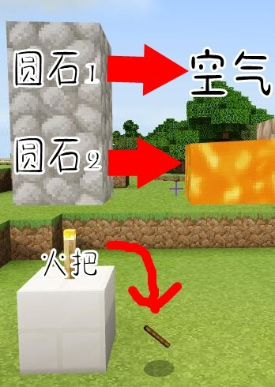
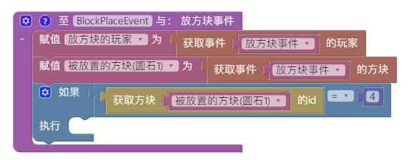
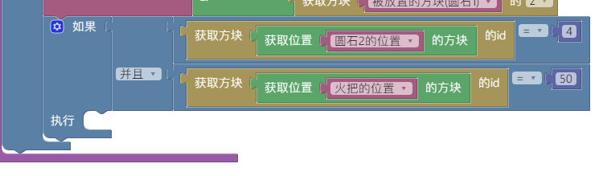
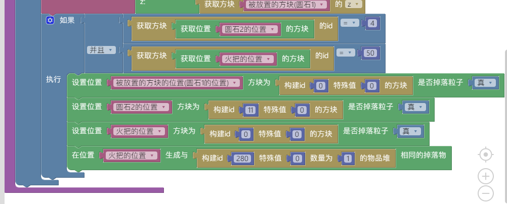

# **第九章 方块与物品**
本章节中，笔者将会为大家讲解如何在bn使用方块和物品功能
**（我sin就是饿死，死外边，从这里跳下去，也不会写小白屁都看不懂的教程）**
(正在施工中，因学业问题会鸽久久久久久，欢迎后人来继续编写)
*****
## **教程**
### *使用火把把圆石烧成岩浆*
**笔者在这教大家怎么让火把会使用洪荒之力，把他头顶上的圆石烧成岩浆，再把头顶上再上面的一层的圆石人间蒸发~**

别问我为什么我这里给的拼图实例看起来那么像两个圆石砸死了火把受到万分惊吓合体返祖回岩浆，警察赶到现场只发现一根木棍的场面。
冰凉拼的图，找他理论别找我

#### 实例编写
物品的id可以从wiki查询哦~
此处是wiki地址：https://wiki.biligame.com/mc/%E5%9F%BA%E5%B2%A9%E7%89%88%E6%95%B0%E6%8D%AE%E5%80%BC
（有时wiki上的跟nk不一样）
~~1. 第一步，
掐着冰凉脖子，把刀放在他脖子上，逼他给你拼
完~~
~~冰凉注：你™想peach?????~~
·
·
·
·
·

此插件实则是让**圆石1位置**、**火把位置的方块变成空气方块**，**圆石2位置的方块变成岩浆方块**，然后**火把位置生成木棍**
**所以我们要先获取圆石1、圆石2、火把的位置，然后再设置哪些方块变成空气，哪些变成其他的方块**
咱们主处理的方块由圆石1先生负责
~~为啥不从火把入手是因为我也不知道，冰凉原教程就这么写~~
1. 第一步，创建玩家放置方块事件的回调函数
获取放置方块的玩家和被放置的方块的数据，并存到变量里

·
2. 第二步，此插件的主角是圆石，所以用*if拼图块*判断被放置的方块是不是圆石（圆石id为4），避免主角光环送错人了

·
3. 第三步，获取被放的方块的位置（圆石1的位置）、圆石2的位置、火把的位置
为了等会使火把和圆石1领便当，圆石2基因突变退化成岩浆，我们要先获取他们的位置

·
4. 第四步，判断圆石2的位置的方块是不是圆石，火把的位置的方块是不是火把（圆石id为4，火把id为50）
问我为什么这么麻烦？
毕竟你先前又没跟js说那两个位置的方块分别是圆石和火把
不判断的话可能出现以下情况↓
惊！某服一石使出泰山压顶精准命中路人and效果拔群结果发现砸错人了

·
5. 第五步，一脚端走圆石1和火把，让他们位置生成空气方块（空气的id是0，木棍id是280），再让圆石2退化成岩浆（静止岩浆id是11）

#### 最终拼图
<iframe src="https://tools.blocklynukkit.com/showblock.html?code=show" frameborder=0 width="100%" height="1080px"></iframe>

*****

### *自定义物品*
#### 实例编写
#### 最终拼图
### *自定义物品——高级工作台*
#### 实例编写
