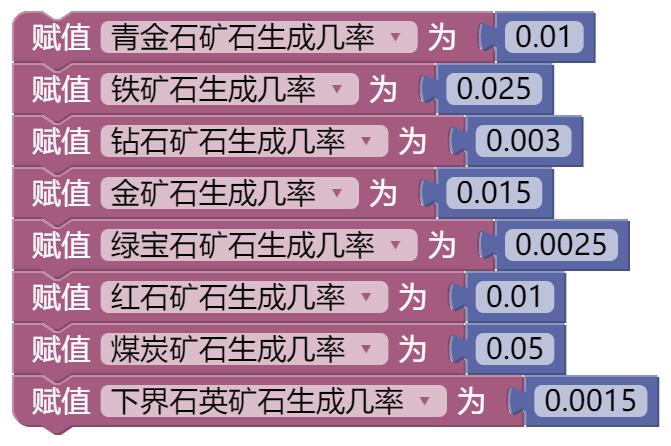
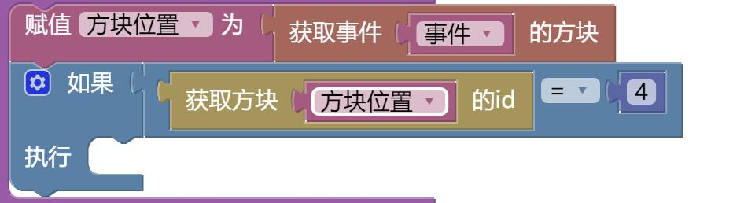
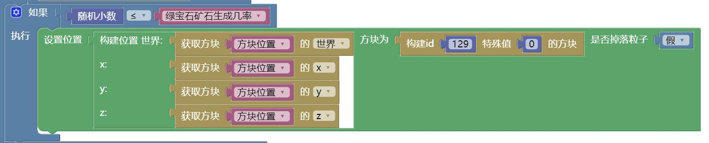

# **第六章 逻辑块的使用**    
在本章节中，笔者将会为大家介绍如何使用BN图形编辑器中的逻辑块，来编写一个随机矿石的插件。    
*****    
## **教程**    
## 逻辑块的概念    
逻辑块是什么呢？逻辑块是一个用来判断某个条件是否成立的块，跟英语使用相类似。**一般地，if的格式为if(某个条件bool类型)那么做什么事情，特别地，后面还会跟有否则……。**    
*****    
## 实例编写    
1.我们要知道，我们因为要随机生成矿石，所以必需要用到几率，所以我们需要先给几率进行赋值，防止在程序内部造成几率不统一，从而出错。当然可以根据自己需要设计几率，下面仅供参考。    
    
2.我们有了生成几率以后，我们要获取是否是刷石机生成。这里需要使用到下一章讲到的事件StoneSpawnEvent。跟玩家进入事件一样，**我们要知道是否生成了石头。所以进行判断。这是本插件最为核心的一部分之一。**    
    
3.然后又需要生成一个随机数，这里使用核心-数学-随机小数即可解决。然后进行判断是否达到了标准。**这也是本插件最为核心的一部分之一。**    
    
*****    
## **最终拼图**    
<iframe src="https://tools.blocklynukkit.com/showblock.html?code=guide_radomore" frameborder=0 width="100%" height="1080px"></iframe>    
    
*****    
## **拓展任务**    
使用本章所介绍内容，为自己的服务器写自定义几率生成随机矿石插件。（样例：[链接](https://www.mcbbs.net/thread-1053877-1-1.html)）（需要使用下面要介绍的配置文件操作）