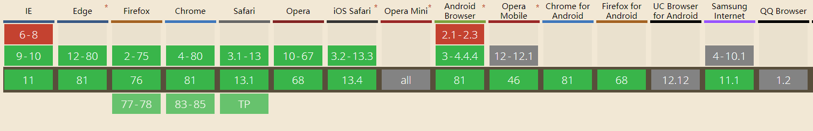

# 前言
*********
虽然blocklynukkit(简称bn)已经为各位抹去了几乎所有配置开发环境的细枝末节，但是还是需要您花费5分钟进行简单的配置
## 下载BlocklyNukkit.jar解释器
bn开发语言为JavaScript，所以需要一个BlocklyNukkit,jar解释器将js翻译为java字节码在nukkit服务器上面运行，安装解释器很简单，只需要下载[BN解释器\(点击下载\)](https://tools.blocklynukkit.com/BlocklyNukkit.jar)并将其放到服务器的插件目录下，重启服务器即可完成解释器安装  
## 图形编辑器安装
图形编辑器是在线使用的，您可以通过打开下方的链接来使用bn图形编辑器
>[success] BlocklyNukkit图形编辑器 https://tools.blocklynukkit.com

各个浏览器对图形编辑器支持性

> 第一行是能够勉强使用部分功能的浏览器对应版本
> 第二行是能够使用全部功能但使用体验不佳的浏览器对应的版本
> 第三行是能够正常流畅使用的浏览器对应的版本
> 第四行是能够支持gpu加速，体验十分优秀的浏览器版对应的版本

您可以直接在这个页面使用bn插件编辑器，如果显示正常，说明您的浏览器支持运行bn编辑器，如果您是手机用户，您可以进群953752196下载专用的安卓/ios客户端
<iframe src="https://tools.blocklynukkit.com" width="100%" height="800px"></iframe>
