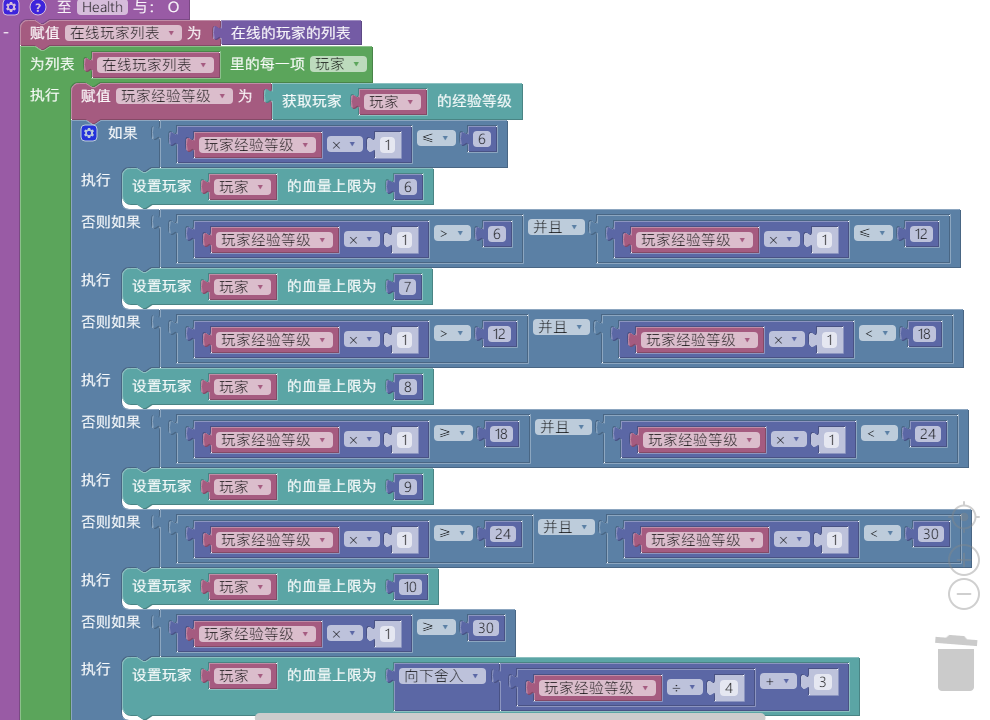
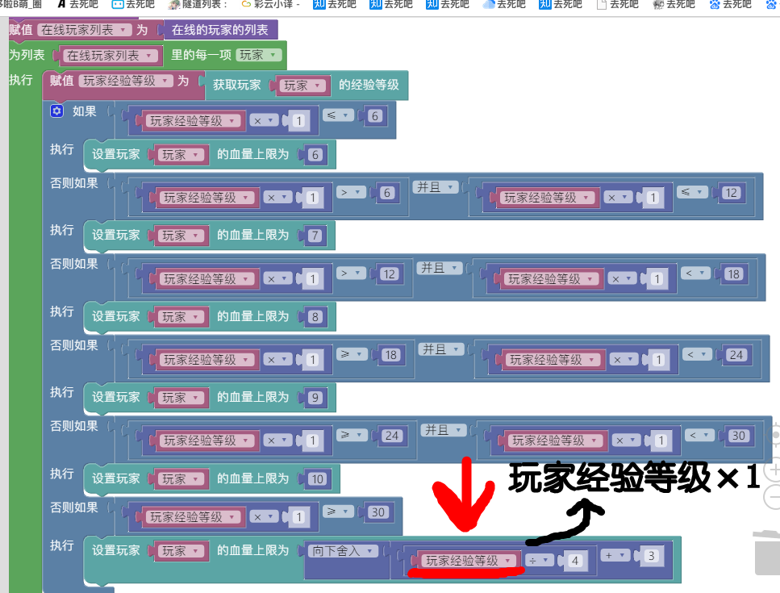

# **疑难杂惑与心得体会 by sininyine**     
您是否学习bn的过程中**遇到困难**？亦或是出不来的**学习瓶颈**？     
当你遇到了却不知道解决方法不妨看看本章节，**笔者将会教你如何面对**     
对本章节若有建议，无妨说说，笔者将会继续补充sininyine     
*****     
## **拼图问题**     
     
虽然自从bn更新1.2.8.3后就可以中文报错，但有时仍会出现疑似冥王星人不明远古代码信号的报错     
以下为大家提供了可能出现的情况与解决方法：     
### *×1*     
     
看到笔者的拼图了吗？     
是否觉得*完美无缺天衣无缝白璧无瑕白玉无瑕四角俱全*？     
啊你这样想也什么大问题，不过把这拼图丢到游戏去屁锤子反应都没有     
怎么回事呢？     
以下为修正过后的     
     
对，没错     
就是这如蚊子腿中的绒毛般细小的错误让你控制台只会冒出一堆类似某教程的语言     
**变值、键值如果要代入算式先×1，因为变值、键值可能是文字**     
如果你不懂变值键值是什么，那就给每个计算拼图块里的非数字拼图块×1     
(如果累死了麻烦来找笔者领取~~笔者的作业~~补偿     
### *控制台提示大法*     
您是否因bn更加张狂嚣张地**不发**杀马特达芬奇型火星文**报错**而困扰？     
您是否曾经在极度愤怒的情况下开启写轮眼并强迫黑影附身也没能**找出某物的值**？     
那么就该logger.info闪亮出场了！     
     
~~不要999，也不要888，只要288，价格不浮夸，厂家直销，质量保证，物美价廉，物有所值，经济实惠。你买不了上党，买不了欺骗。它可以这样用，也可以这样用，还可以这样用，方式多样，随心搭配，自由多变，一定符合你的口味！~~     
     
### *死也找不出拼图的错误*     
     
我相信每个人都跟读者一样遇到了拼图出错，寻找问题却找不出该死的问题，烦的想踢隔壁家汤姆叔叔的屁股一脚     
不要暴躁，不要砸电脑     
~~欲练神功，必先自宫~~     
以下为小建议：     
1. 一遍遍仔细地一块一块审视、修改你的拼图     
您可以一遍一遍地更改拼图进行测试，但请记得**保存原件**     
否则越改越稀巴烂却又没法拼回去     
2. 问大佬     
如果您试了十几遍也没找出错误，那么您可以选择~~绑架冰凉让他给你拼~~询问大佬了，**不要再**一个人傻傻地试了，您再试也只是跟拿洗发水疯狂搓满是虱子的头一样徒劳     
## **额外的问题**     
### *正确询问大佬的方法*     
（此处所说的大佬仅指比自己厉害的人）     
     
遇到自身解决不了的问题的最快解决方法是：问大佬     
但大佬不是像~~睿智人工智障~~人工智能一样，你问就能答     
下面是正确询问大佬的方法：     
1. **清清楚楚**地说明你的问题。     
遇到的问题、原本期望的效果、拼图截图、报错信息，请如实给出     
否则也就你肚子里的蛔虫知道你在问啥     
2. 态度     
不要一副大爷样，大佬不是你的小弟，也不是专属客服，你也不是二次元金发双马尾暴娇美少女     
**虚心请教，以真诚的态度询问**     
问完请说句谢谢，这是给大佬最大的回报     
3. 脑子在线     
我相信大家都会有智商下线的时候     
但是绝对不要让脑子时刻扑街     
**请询问问题前动脑子认真思考你的问题**     
有些慈母菩萨型大佬无论你问多少sb问题他们都耐心地总会回答     
**但是群里没有**     
不要再吃屁，好好动动脑     
     
4. 怂     
我相信有部分萌新对于询问大佬是感到害怕的，宛如拿着新手村最好的剑去捅恶龙一样     
实则笔者在一开始询问大佬也感到害怕，怕丢人、大佬生气、被嫌弃     
放心好了，在大佬眼里你只是一个**平常人**，大佬也只是一个bn玩的熟练的**平常人**     
**不用在意他人的眼光**，一个真正的大佬是不会嘲笑刚刚开始学的人的，因为他们很清楚：     
**一个技能从婴儿一步步升到专家，要经过多长时间和练习，要丢多少人**     
恰恰是那些水平其实就那样的人会说“这都敢出来混”     
### *学习瓶颈*     
     
每个人一开始都必定充满动力的，但当学到一个点这些动力就像你的头发一样飘走了     
以下是~~由肝组成的~~冰凉的小建议：     
1. 开服务器     
虽然服务器就一两个人，凄惨的一批，但是逐渐地，慢慢地多了起来~~如人类远古时期交配繁殖般~~     
你会感到**被玩家需要的快乐**，你所做的插件都能带给玩家有意思的体验     
~~像养猫猫狗狗~~     
2. 发布你的插件     
即使你的插件只被几个腐竹使用，但也组成了其他腐竹服务器的一部分     
**你的插件能给玩家、腐竹带来了极大的帮助**     
不断发布插件，**不断获得小小的满足**，你也会慢慢地成长为~~鸽子~~大佬     
3. sin的建议:写作业     
没什么动力建议先写作业，写作业的时候就会发现除了作业什么都很有趣，包括拼hello world     
## **bn大佬的成长之路**     
     
  每个大佬在成长历程中，**大部分时间都是耐心做系统的学习，不焦不躁地动手练习基本功，理解一个个原理；少量时间找老师或者前辈指导自己解决不了的难点，然后根据原理和反馈，审视自己的作品，推演出如何提升的具体方法；自信地、脚踏实地的跨越一个个小坎儿，如此往复**     
那些我们看到的闪亮的大佬，不过是这些小小的努力，日积月累的成果造出的人     
     
有人相信，天赋决定成败；有人说时机决定命运；还有人说，好的老师指引，才是一个人成功的点睛之笔。但不管怎样，点睛之笔前，咱总得自己先画个龙吧——抖抖村     
