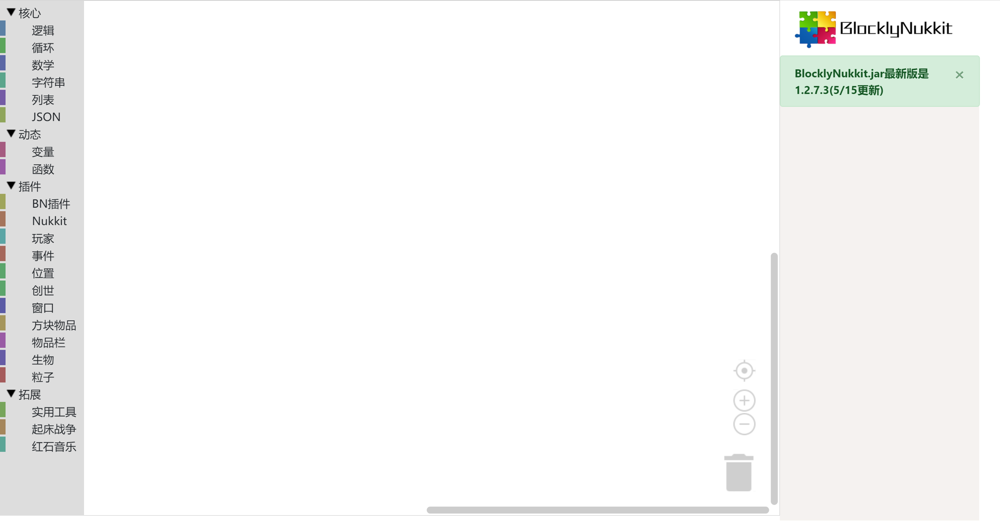

# BlocklyNukkit  
## 欢迎  
欢迎来到blocklynukkit！  
blocklynukkit是一套完整的从入门到高阶的快捷简单高效率插件开发框架，解决了各位希望开发插件但又苦于难以入门或没有开发条件的新人或开发者的问题，使得各位服主可以快速零基础上手开发插件并快速学习开发插件的精髓，不必在意没有用的繁琐细节，并实现自己的创想！  
  
## 目标使用者  
- 零基础入门nukkit插件开发的初学者  
- 想快速实现自己的想法的服主  
- 没有电脑或java编译环境的nukkit插件开发者  
- 只会JavaScript或者python又想开发插件的人  
- JavaScript或者python十分熟练的服主  
- 希望掌握新技能的开发者  

## 如何开发  
**下文的BN、bn均指代BlocklyNukkit**  
### 使用图形化编辑器开发  
BlocklyNukkit最大的特点之一就是为没有任何编程经验或者基础的人提供了一个简单、快速、高效的图形化编辑器，使用图形化编辑器，您可以快速地通过类似于scratch的拖拽拼图的方式实现简单的插件，并且可以直接打包成jar发布。  
要使用BlocklyNukkit图形化编辑器，只需在浏览器打开[https://tools.blocklynukkit.com](https://tools.blocklynukkit.com)  
对于法语用户，请打开[https://tools.blocklynukkit.com?language=french](https://tools.blocklynukkit.com?language=french)  
请注意，法语翻译由用户自行贡献，非开发团队维护。如果您也希望贡献自己语言的翻译，请参考[翻译贡献教程](https://www.kancloud.cn/superice666/bn_guide/1741091)  
对于英语用户，开发团队正在竭力进行英文翻译，请您耐心等待，我们将在7月10日左右添加英文翻译  
您可以到BN教程库[http://blocklynukkit.info](http://blocklynukkit.info)学习如何使用  
或者到我们的qq群953752196中学习如何使用  
也可以通过discord链接[https://discord.gg/94YWU9X](https://discord.gg/94YWU9X)加入我们的服务器来沟通、学习  
bn图形化编辑器展示：  
  
### 使用JavaScript开发  
BlocklyNukkit提供了一套成熟的JavaScript开发插件的解决方案，您可以使用JavaScript来开发插件。我们编写了JavaScript开发文档和配套的vscode插件来方便开发，开发完的代码可以直接打包成jar包发布，详细资料详见[JS插件开发](https://wiki.blocklynukkit.com/%E8%BF%90%E8%A1%8C%E6%97%B6%E8%A7%A3%E9%87%8A%E8%AF%AD%E8%A8%80/JS%E6%8F%92%E4%BB%B6%E5%BC%80%E5%8F%91/)  
### 使用Python开发  
BlocklyNukkit在最新版本中提供了Python开发的能力，支持全部标准原生Python库和全部的Java类库直接导入，而且您还可以直接import其他插件的类、函数与对象进行操作。详细资料详见[Python插件开发](https://wiki.blocklynukkit.com/%E8%BF%90%E8%A1%8C%E6%97%B6%E8%A7%A3%E9%87%8A%E8%AF%AD%E8%A8%80/Python%E6%8F%92%E4%BB%B6%E5%BC%80%E5%8F%91/)  
### 使用Lua开发  
BlocklyNukkit在最新版本中提供了使用Lua5.2开发的能力，支持全部标准原生Lua库和全部的Java类库直接导入，而且您还可以直接导入其他插件的类、函数与对象进行操作。我们编写了配套的VSCode插件来方便开发，开发完的代码可以直接打包成jar包发布，详细资料详见[lua插件开发](https://wiki.blocklynukkit.com/%E8%BF%90%E8%A1%8C%E6%97%B6%E8%A7%A3%E9%87%8A%E8%AF%AD%E8%A8%80/Lua%E6%8F%92%E4%BB%B6%E5%BC%80%E5%8F%91/)  
### 使用PHP开发  
BlocklyNukkit在最新版本中提供了使用PHP5.7开发的能力，支持全部标准原生PHP库和全部的Java类库直接导入，而且您还可以直接导入其他插件的类、函数与对象进行操作。我们编写了PHP打包成jar包发布，详细资料详见[PHP插件开发](https://wiki.blocklynukkit.com/%E8%BF%90%E8%A1%8C%E6%97%B6%E8%A7%A3%E9%87%8A%E8%AF%AD%E8%A8%80/PHP%E6%8F%92%E4%BB%B6%E5%BC%80%E5%8F%91/)  
### 使用C/C++开发  
BlocklyNukkit在最新版本中提供了使用C/C++开发的能力，C/C++代码可以用过我们提供的基于clang编译器定制的sdk进行开发，调试和编译，我们使用webassembly（web汇编）作为目标码，真正实现C/C++一次编译，全平台运行。所有的代码都会运行在安全的jvm沙箱中，且性能损失相较原生二进制机器码损失不到10%，支持C/C++与java、javascript、php、python、lua互调用，详细资料详见[使用C/C++开发](https://wiki.blocklynukkit.com/%E8%BF%90%E8%A1%8C%E5%89%8D%E7%BC%96%E8%AF%91%E8%AF%AD%E8%A8%80/C-C++%E6%8F%92%E4%BB%B6%E5%BC%80%E5%8F%91/)  
## 做出贡献  
您可以在一下三方面做出贡献  
1. 图形化编辑器多语言翻译  
2. 帮助blocklynukkit.info网站的教程编写  
3. 贡献项目代码  
多语言翻译与帮助教程编写详见http://www.blocklynukkit.info的开发wiki章节的参与贡献教程，贡献项目代码请联系开发组或超神的冰凉。  
*****  
**教程补充来源(部分)**  
以下链接不分先后  
- [NukkitX Javadoc](https://ci.nukkitx.com/job/NukkitX/job/Nukkit/job/master/javadoc/index.html?overview-summary.html)  
- [Java 8 API docs](https://docs.oracle.com/javase/8/docs/api/index.html)  
- [Python Documentation](https://docs.python.org/zh-cn/)  
- [w3school 在线教程](https://www.w3school.com.cn/index.html)  
