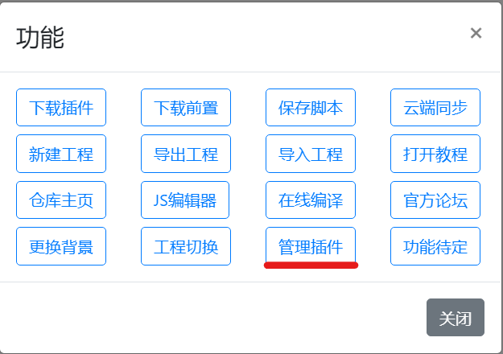
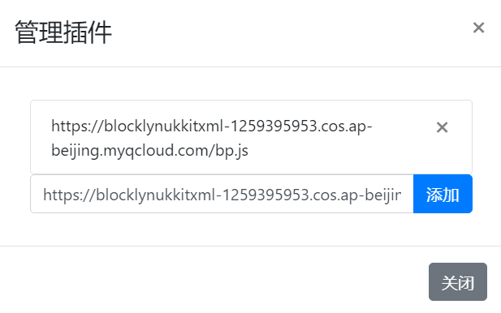

# 添加编辑器拓展
[toc]
## 打开拓展管理器
打开blocklynukkit图形化编辑器，点击右上角的功能菜单，点击管理插件选项，进入编辑器拓展管理界面：

编辑器拓展管理页面如下：

## 从网络链接添加拓展
在弹出的编辑器拓展管理界面的”请输入插件链接“输入框中输入插件的链接，而后点击添加按钮即可，点击后，链接即会出现在插件列表中：
这里我们提供一个测试用插件：https://blocklynukkitxml-1259395953.cos.ap-beijing.myqcloud.com/bp.js

**注意，第一次安装插件，由于浏览器原因，部分浏览器中可能插件列表中的链接显示以undefined开头，此时点击这一个链接右侧的叉号删除掉重新添加即可**

## 加载新添加的拓展
拓展添加完后，重新刷新页面即可在拓展菜单栏使用刚刚安装的拓展了

