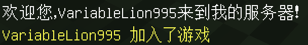

# 从C/C++监听事件  
本章节中，笔者将带你尝试监听nukkit服务器的事件，实现动态的功能。  
## 什么是事件？  
事件，是nukkit服务器运行过程中发生特定活动时产生并广播的对象。通过监听事件，您可以在特定事件发生的时候进行处理，从而完成更丰富的对服务器的控制。  
## 有哪些事件？  
请查看[事件总表](http://www.blocklynukkit.info/1735257)  
## 创建事件监听函数  
当事件监听函数被调用的时候，会传入一个事件对象的的java堆栈索引，所以我们的事件监听函数需要有一个int类型的参数，事件监听函数必须被`EXPORT()`宏修饰，参数内容是导出的名字，用以进行区分，所有导出的名字不能相同，导出的名字可以跟函数名不同，无需加上双引号，不支持变量。  
例如如下的程序：  

```c++
#include <blocklynukkit>  
using namespace std;  
using namespace BlocklyNukkit;  
EXPORT(myListener)  
void listen(int event){  
}  
int main(){  
    return 0;  
}  
```  
此时，linten函数在nukkit眼中的名字就是`myListener`而不是`listen`，没有被`EXPORT`宏修饰的函数，编译器在编译的时候不会为其生成java链接代码，也就无法从java进行调用。  

******  

接下来，我们将其绑定到对应的事件之上。在本章节中，我们将尝试实现一个玩家进服公告的功能，所以我们应该把它绑定到玩家进服事件上，查表可知事件名为`PlayerJoinEvent`：  

```c++
#include <blocklynukkit>  
using namespace std;  
using namespace BlocklyNukkit;  
EXPORT(myListener)  
void listen(int event){  
    logger << "监听成功" << endl;  
}  
int main(){  
    implementJFunction("PlayerJoinEvent","myListener");  
    return 0;  
}  
```  

编译运行以上代码，进服，你会发现如下输出：  
  

## 处理事件  
查阅事件总表时，你会在`PlayerJoinEvent`下面发现如下的函数声明：  
*   TextContainer getJoinMessage()  
*   Player getPlayer()  
*   boolean isCancelled()  
*   String getEventName()  
*   void setCancelled(boolean)  
*   void setJoinMessage(TextContainer)  

是的，这些都是这个事件的成员函数，调用成员函数的方法我们已经说过了，我们现在要实现一个给进服的玩家发送消息的功能。  
给玩家发送消息，就是调用玩家对象的`sendMessage`成员函数，具体的nukkit中各个java类的对象，你可以在[Nukkit Java文档](https://ci.nukkitx.com/job/NukkitX/job/Nukkit/job/master/javadoc/index.html?overview-summary.html)中查询到。下面是一个示例：  

```c++
#include <blocklynukkit>  
using namespace std;  
using namespace BlocklyNukkit;  
EXPORT(myListener)  
void listen(int event){  
    int getPlayerMethod = getJMethod(event, "getPlayer", ";");  
	int player = invokeJMethod(getPlayerMethod, event, 0, NULL);  
	int getNameMethod = getJMethod(player, "getName", ";");  
	int jName = invokeJMethod(getNameMethod, player, 0, NULL);  
	string message = "欢迎您，" + getJString(jName) + "来到我的服务器！";  
    int jMessage = pushStringToJavaStack(message);  
    int sendMessageMethod = getJMethod(player, "sendMessage", "*;");  
    int args[] = {jMessage};  
    invokeJMethod(sendMessageMethod, player, 1, args);  
}  
int main(){  
    implementJFunction("PlayerJoinEvent","myListener");  
    return 0;  
}  
```
  
编译运行结果如下：  
  
