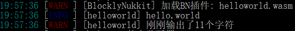
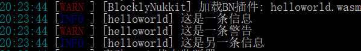
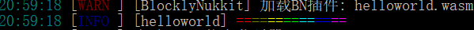

# 从HelloWorld开始  
本章节中，笔者将带您开发第一个简单的C++插件  
## 引用BN头文件  
开发一个bn插件，引用bn的头文件来进行开发肯定是必要的，我们现在来搭建一个空的bn插件模板：  
```c++
#include <blocklynukkit>  
int main(){  
    //do something  
    return 0;  
}  
```  
## 使用经典的C风格输出  
bn提供了两个函数`logf`和`warnf`用于在控制台进行输出，用法同C标准库中的`printf`函数是一样的，下面是一个示例：  
```c++
#include <blocklynukkit>  
int main(){  
    auto world = "world";  
    auto char_amount = BlocklyNukkit::logf("hello,%s",world);  
    BlocklyNukkit::warnf("刚刚输出了%d个字符",char_amount);  
    return 0;  
}  
```  
你可能注意到了，在`logf`与`warnf`两个函数前我们使用了`BlocklyNukkit::`这个命名空间修饰符，在C++中，BN的所有函数都是定义在`BlocklyNukkit`这个命名空间下的，在C语言中无需这么做，如果不想这么做，可以在代码开始时使用`using namespace BlocklyNukkit`来一次性引用。  
## 第一次编译  
接下来，我们通过bn提供的编译工具来将这个代码编译，我们的文件名为`helloworld.cpp`，现在将其复制到编译工具文件夹中，在此处打开命令行(cmd)窗口或windows powershell，输入以下编译命令：  
```
.\cpp helloworld.cpp helloworld.wasm  
```  
短暂的等待后，目录下输出了文件`helloworld.wasm`。  
## 运行插件  
将刚刚编译出来的`helloworld.wasm`复制到服务器`plugins`文件夹中的`BlocklyNukkit`文件夹中，启动服务器，如果开发环境搭建无误，你就会看到如下的输出：  
  
## 使用C++风格进行输出  
在提供经典C风格输出的同时，bn也提供了一个现代的C++流式输出，用法就像标准库中的`cout`一样，下面是一个示例：  
```c++
#include <blocklynukkit>  
using namespace BlocklyNukkit;  
int main(){  
    logger << "hello" << "," << "world" << "前面有" << 11 << "个字符" << endl;  
    return 0;  
}  
```  
编译运行以上代码，会得到如下输出：  
  

*********  

当然，对于`logger`，bn提供了`info(信息)`与`warning(警告)`两种输出方式，logger的默认输出方式是`info`，你可以通过下面的方式来改变它的输出方式：  
```c++
#include <blocklynukkit>  
using namespace BlocklyNukkit;  
int main(){  
    logger << "这是一条信息" << endl;  
    logger << warningMode << "这是一条警告" << endl;  
    logger << infoMode << "这是另一条信息" << endl;  
    return 0;  
}  
```  
编译运行上述代码，会得到如下输出：  
  

**********  

想在控制台输出彩虹？没问题，bn提供了16种标准的控制台颜色供你使用！下面是一个输出彩虹的例子：  
```c++
#include <blocklynukkit>  
using namespace BlocklyNukkit;  
int main(){  
    logger << RED << "==" << GOLD << "==" << YELLOW << "==" << GREEN << "=="  
        << AQUA << "==" << BLUE << "==" << LIGHT_PURPLE << "==" << endl;  
    return 0;  
}  
```  
编译运行以上代码，会得到如下输出：  
  
## Q&A  
- Q：为什么不使用`printf`或者`cout`呢？  
A：根据Nukkit插件的推荐规范，所有的插件都应该使用`控制台Logger`对象输出，而非直接写入标准输出流，使用bn的函数时，所有的输出将会自动记录到服务器日志并在关服后压缩保存。  
- Q：为什么没有输入？  
A：输入是有的，但是nukkit的控制台输入是命令系统的一部分，后面的章节将详细阐述  
