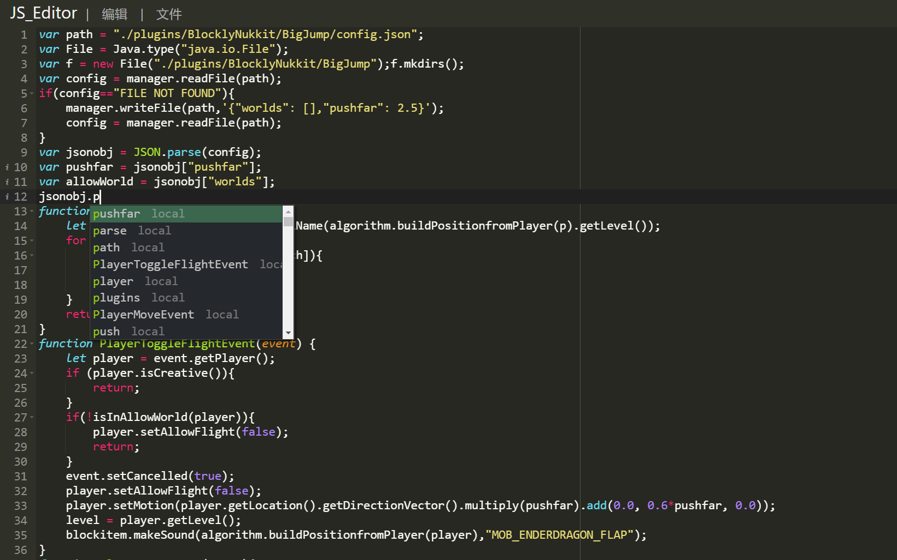
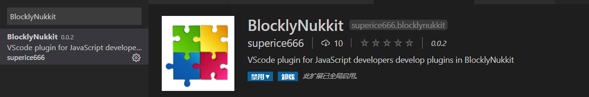

#  如何js开发插件
首先，请确保正确配置了最新版bn解释器
- 使用在线ide
>[info] 在线IDE是blocklynukkit团队打造的网页版js编辑器，专为blocklynukkit打造，具有语法高亮，云端同步，自动补全，代码排版等基础功能，可运行在所有主流浏览器上，包括安卓webview、safari、谷歌等
> >[success] 在线IDE使用地址 [https://tools.blocklynukkit.com/jseditor.html](https://tools.blocklynukkit.com/jseditor.html)
> > 
> 
> 在本页面直接使用：
> <iframe src="https://tools.blocklynukkit.com/jseditor.html" width="100%" height="800px"></iframe>

- 使用vscode插件
>[info] blocklynukkit团队为vscode打造了定制插件，推荐各位使用电脑的开发者使用vscode+bnvscode插件开发，极大提升开发效率。提供了启发式语法补全，事件自动补全，一键同步到云端等功能。>
> >[success] 直接在拓展包管理器搜素 <kbd>BlocklyNukkit</kbd> 即可安装
> > 