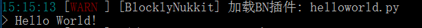
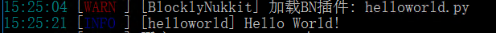

# Hello World!
## 创建你的第一个插件
创建一个插件十分简单，只需要新建一个python文件即可，后缀名为 .py
本章我们将制作一个亘古不变的入门插件，它的功能为在服务器启动的时候输出一句Hello Wolrd!
~~(好像大家教程都是这么写的)~~
新建一个文件 **helloworld.py** 然后使用vscode以utf-8格式打开它（utf-8格式是bn接受的唯一文件编码格式）。
## helloworld
在第一行输入一行注释 #pragma python
```python
#pragma python
```
这表明了这个插件是使用python写的，bn根据这一行来区分python和其他编程语言
接下来我们输入输出helloworld的代码
```python
#注释
print u"Hello World!"
```
>[warning] 注意，在bn插件的开发中，bn默认的字符串解析方式是utf-8，即bn传入和传出的字符串统一使用unicode字符串，如果您声明字符串的时候不使用unicode，将会造成乱码

将文件保存并上传到服务器的./plugins/BlocklyNukkit文件夹

重新启动服务器,你会看到我们的插件被成功加载并且输出(这里我们使用源码运行,以后会介绍如何编译为jar后运行)

## logger基对象
你可能很敏感地发现,我们的helloworld插件和其他插件的输出格格不入. 为了解决问题,bn提供了一个基对象叫做logger,基对象是bn内置的对象,无需声明即可使用,我们使用logger基对象的成员函数(又称方法)info来进行输出,就可以看到类似于nk插件的效果了
```python
#pragma python
logger.info(u"Hello World!")
```
上传到服务器并且重启,我们可以看到插件正确地输出了"Hello World!"字符串

>[info] 什么是基对象?
> 先简单的介绍一下什么是对象,对象是一堆函数和变量的集合,一个对象里面包含着一堆函数和变量,我们把这些在对象里面的函数和变量叫做对象的成员,使用 对象名.成员变量名 就可以获得变量的这个成员函数的值,使用 对象名.成员函数名(参数) 就可以执行对象里面的函数并且获得这个函数的返回值.
> 基对象就是blocklynukkit在运行插件的之后默认存在的对象,无需赋值等等,bn会自动把这些注入到运行环境中,你只需要调用就行了,上面我们调用了logger基对象,bn提供了很多基对象,bn插件开发的很大一部分内容就是通过这些基对象来和整个nk服务器交互,如果你想知道更多关于基对象的东西,去编程开发文档看一看吧

## 拓展任务
尝试使用logger基对象中的warning函数,在控制台以警告的形式输出你服务器的名字
warning函数的使用可以去查看编程开发文档和logger基对象详解