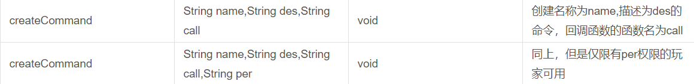
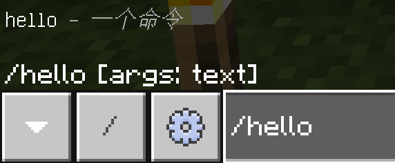
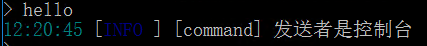
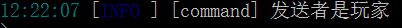

---  
toc: true  
---  
# 创建命令  
## 什么是命令  
命令是一种特殊的聊天信息，在游戏聊天框中用 **/** 来标识一个命令，命令是最常见的插件与玩家交互的方式。  
## 创建一个命令  
在使用python开发bn插件中，我们使用manager基对象来创建一个命令。  
查阅[编程开发文档](http://www.blocklynukkit.info/1723846)可知：我们使用createCommnad函数来创建一个命令  
> 技能：识读函数表  
> blocklynukkit编程开发文档中提供了很多函数表，这里教您如何识读它们  
> 您会看到每一张函数表可能是在基对象下面的，如manager基对象，这意味着这个函数表内的所有函数都是在这个基对象里面的，要调用这些函数，您不能直接使用函数名，而是需要使用 **基对象名称.函数名称(参数)** 这样来调用  
> 基对象函数表的题头一般如： **方法名 参数 返回值 解释**  
> **方法名**一列表示函数的名字，在后面的面向对象中我们会讲，在一个对象里面的函数又可以称作*方法*  
> **参数**一列表示调用这个函数，你需要向这个函数传入的参数，每个参数会用逗号隔开，用逗号隔开的每一个参数都有两部分表示，第一部分（即空格左边的部分）是表示这个参数能够接受的类型，后面你则表示这个参数的名称，传入的时候，你只需要按顺序传入正确的类型即可  
> **返回值**一列表示这个函数调用后是否有返回值和返回值的类型，如果为void表示这个函数没有返回值  
> **解释**一列是对这个函数的一些文字解释  
> *******************  
> 以阅读manager基对象下面的createCommnad为例：  
>   
> 你会发现有两行都是createCommand函数，这是因为createCommnad有两种传入参数的方式，所以写了两次  
> 其中createCommand是这个函数的名称，调用的时候我们只需要使用manager.createCommand(xxxxx)就可以调用，它接受两种函数类型，分别是3个字符串作为参数和4个字符串作为参数，当接受三个字符串作为参数的时候，第一个字符串参数的名字是name，我们看解释得知第一个字符串参数name是要创建的命令的名称，第二个字符串参数的名字是des，我们看解释得知第二个字符串参数des是对这个命令的一些文字描述，第三个字符串参数的名字是call，我们看解释得直第三个字符串参数call是这个命令被执行之后的用于处理命令被调用的函数的名称。当接受四个字符串作为参数的时候，前三个跟之前一样，第四个字符串参数名字叫per，我们看解释得知第四个字符串参数per是这个命令的权限节点的名称。  
> 我们再来看返回值，可以看到无论调用这个函数的时候是传入了三个还是四个参数，返回值都是void，即没有返回值。  
查阅得知，createCommand函数可以用来创建一个新的命令，我们现在就来使用它创建一个新的命令hello  
*command*.*py* ：  
```python  
# -*- coding: utf-8 -*-  
#pragma python  
manager.createCommand("hello",u"一个命令","myCallBack")  
def myCallBack(sender,args):  
    pass  
```  
这样，我们就创建了一个新的命令，这个命令的名称是hello，描述为“一个命令”，用于处理命令输入的回调函数的名字是myCallBack，并且我们在下面声明了一个空函数，名称也是myCallBack，这就是我们的回调函数。  
我们赶紧进服看看：  
  
我们发现，命令hello已经出现在命令列表里面了！但是由于我们设置的回调函数里面是pass，所以输入了命令什么反应都没有。  
> 拓展：回调函数编程模型  
> 可能您对什么是回调函数，为什么上面要那样去写感到疑惑，这里为您解释blocklynukkit的回调函数编程模型。  
> 回调函数是指由bn在触发点激活的时候自动调用的函数，触发点就是一条激活的规则，比如在命令回调函数中，触发点就是玩家或者控制台输入命令，这个时候，由于您一开始程序的时候在创建命令的函数中向bn声明函数名为myCallBack的函数为回调函数，所以bn会在检测到玩家或者控制台输入您创建的命令的时候就会自动去查找有没有名字是myCallBack的函数，找到了之后就会准备好这个函数对应的参数，然后触发这个函数。  
## 判断是否由玩家发出命令  
现在我们来对回调函数进行修改，你会看到我们的回调函数接受了两个参数，这是规定，必须要这样做，bn会把第一个参数设置为一个发送者对象，第二是命令参数列表：  
发送者对象是什么？首先，我们要说明一点，发送者对象不是玩家或者控制台哦！它是一个抽象，包含了这个发送者（玩家或者控制台）的必要信息。  
下面我们来对发送者对象进行一下实践：  
```python  
# -*- coding: utf-8 -*-  
#pragma python  
manager.createCommand("hello",u"一个命令","myCallBack")  
def myCallBack(sender,args):  
    if sender.isPlayer():  
        logger.info(u"发送者是玩家")  
    else:  
        logger.info(u"发送者是控制台")  
```  
可以看到，我们刚刚修改了myCallBack函数的内容，而myCallBack函数正是我们在第三行（包括注释）创建的命令所标注的回调函数，一旦这个命令被输入，我们的回调函数就会被执行，我们在回调函数中使用了sender.isPlayer()来判断发送者是否为玩家，然后输出是不是玩家，我们现在去进服测试一下：  
*在控制台输入hello命令*  
  
*在游戏中输入hello命令*  
  
这样，我们就成功地识别出发送命令的是否是玩家，这样方便我们执行一些操作，也能避免诸如传送控制台，给控制台添加药水效果，给控制台添加金币等等这样的低级错误。  
## 判断命令参数(子命令)  
在开服的过程中，你可能会见到多级命令，比如：  
*/money give xxxxxx*  
但是，我们注册的命令中不能含有空格，含有空格的命令是无法被触发的(mc客户端限制)，此时，我们就要通过判断命令参数来实现类似的功能  
bn中，命令的所有参数将会以一个列表的形式传入命令回调函数的第二个参数  
> 命令回调参数列表  
> 命令回调参数列表是由整个命令语句，除去主命令名和前缀斜杠之后，以空格分隔开之后的内容  
> 比如：命令gamemode 1 Steve中，命令名是字符串gamemode 参数列表是[u'1','u'Steve]  
举个栗子：  
```python  
# coding:utf-8  
#pragma python  
manager.createCommand("hello",u"一个命令(后面跟着你想对谁说话(玩家/控制台))","helloworld")  
def helloworld(sender,args):  
    if args[0] == u'控制台':  
        logger.info(sender.getPlayer().getName() + u'向您问好！！')  
    else:  
        if len(args) > 1:  
            del args[0]  
            #把后面的参数连起来  
            #发给发送者  
            summer = ''  
            for i in args:  
                summer+=i  
            sender.getPlayer().sendMessage(summer)  
```