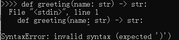

---  
toc: true  
---  
# py2k 和 py3k 有什么区别？(Jython和CPython有什么区别？)  
如果您是新手，可以忽略这篇文章。  
如果您是py3k爱好者，那么请耐心把文章看完。  
1.Py2k没有[Generic Alias Type](https://docs.python.org/zh-cn/3/library/stdtypes.html#generic-alias-type)(GAT)  
---  
如果您长期使用python 3.5+版本的话，应该会经常用到一个叫Generic Alias Type的技术。  
比如像下面这样：  
~~~python  
def greeting(name: str) -> str:  
    return 'Hello ' + name  
~~~  
但很遗憾，直到python 2.7.13，官方仍然没有加入这个东西.  
倘若你直接把这段代码硬要塞入py2k的解释器的话，解释器会表示非常的"开心"：  
  
2.Jython不支持多进程，也没有GIL  
---  
如果你用过Jython，就会知道，Jython是不支持多进程的  
倘若你硬是要导入多进程模块，那么你将会得到一个错误：  
  
没错，Jython根本就没有多进程！  
~~实际上是因为Java自身就不支持多进程~~  
那么我们只能用多线程了。  
那么聪明的小朋友们又会发问了：多线程不是有GIL吗？那不就没效率了吗？  
emmmm，GIL实际上是CPython的老东西，jython并不需要。感兴趣的同学可以研究一下[Jython的源代码](https://github.com/jython/jython)  
3.py2k没有异步支持  
---  
自从Python 3.5加入异步编程这个东西之后，大家用异步用的不亦乐乎。  
但是直到Python 2.7.x 并没有加入异步编程的支持(准确的说是加入了，但并不完善)。因此，建议把异步代码换成多线程并发代码，以兼容python 2.x 。  
python不完善的异步编程支持  
*   [17.6. `asyncore` — 异步socket处理器](https://docs.python.org/zh-cn/2.7/library/asyncore.html)  
*   [17.7. `asynchat` — 异步 socket 指令/响应 处理器](https://docs.python.org/zh-cn/2.7/library/asynchat.html)