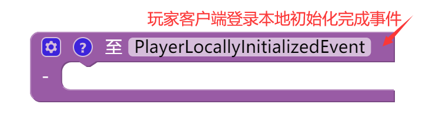
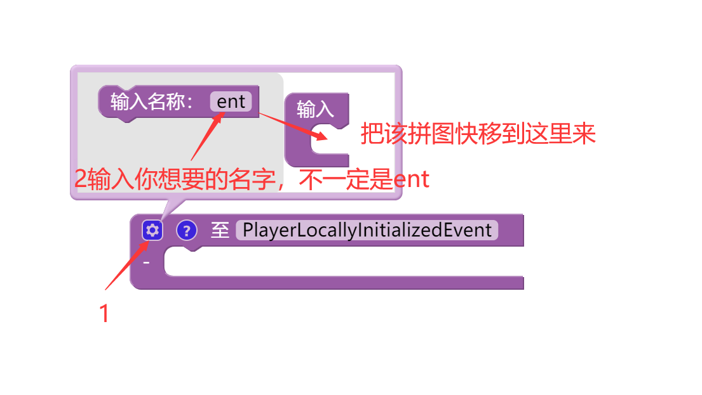
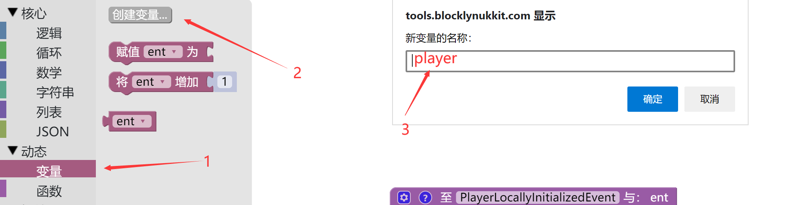
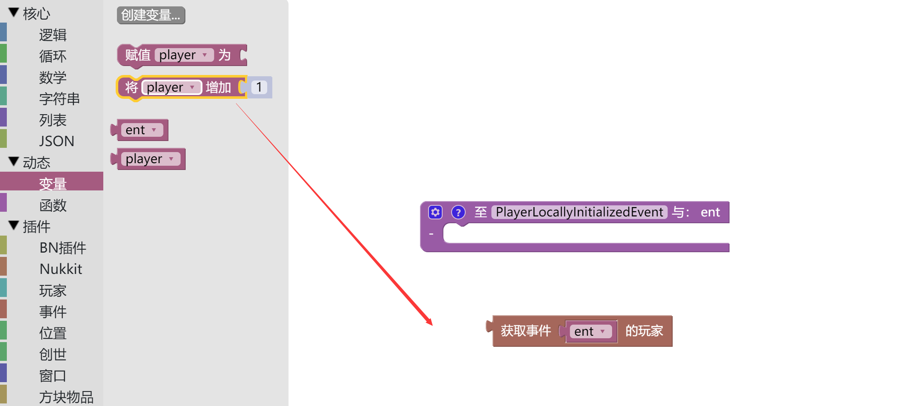
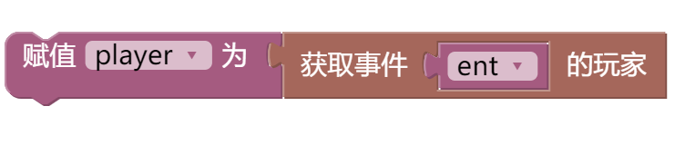
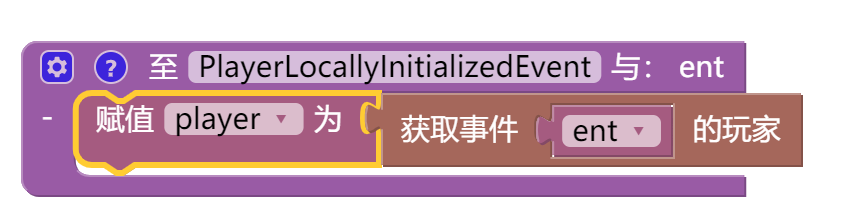
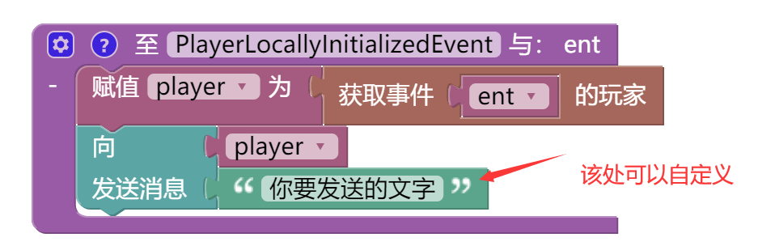
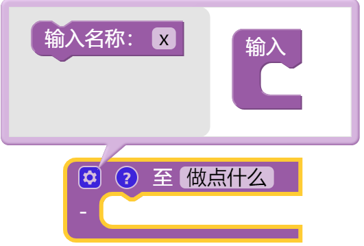

# **第五章 进服欢迎**
[TOC]
在本章节中，笔者将会为大家介绍如何使用BN图形编辑器编写你的第二个插件”进服欢迎"
*****
## **教程**
## 实例编写
1.首先找到动态-函数-至【】，在空格中输入**PlayerLocallyInitializedEvent**，意思是玩家进入了游戏并加载成功事件。

2.BN会为你提供一个事件，该事件可以通过声明变量完成。所有的事件都可以通过该方式获取你要的值。

3.有了ent以后，我们就可以通过ent获取进服的玩家。通过拼图块插件-事件-获取事件【】的玩家。

4.我们要把一个变量赋值为该玩家，方便给该玩家发送消息。然后把该拼图快拖到函数中。

5.然后通过插件-玩家-向【】-发送消息【】，向进服玩家发送消息。
*****
## **反思与总结**
在本章节中，我们制作了一个较为简单的进服欢迎，这是我们的制作的第一个可以运用在正式服务器中的插件，恭喜你，已经迈开了制作插件的第一步。
>[info]
本章节中，我们第一次用到了函数。函数在我们以后的插件编写中尤为重要。函数可以用来触发事件。

>[info]
我们第一次用到了局部变量，该变量可以获取函数的输入值，如果是事件的话，NK会输出该事件的实例，我们就可以通过该事件来获取各种我们需要的信息

>[info]
我们用到了获取事件【】的玩家。我们可以用该块获得触发事件的玩家。

>[info]
我们用到了向【】发送消息【】，可以通过该块向玩家在聊天栏中发送消息。
*****
## **最终拼图**
<iframe src="https://tools.blocklynukkit.com/showblock.html?code=guide_EnterWelcome" frameborder=0 width="100%" height="1080px"></iframe>

*****
## **拓展任务**
使用本章所介绍内容，为自己的服务器写一个OP进服全体玩家提示插件。